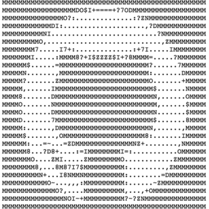

# goasciiart
Convert pictures to ascii art use golang

## Installation

```
go get github.com/stdupp/goasciiart
```

## Usage

```
./goarciiart -c abc.jpg(png) -w 80

-p path of your picture
-w the width of output
```

## Sample

<figure class="half">
    
    
</figure>
